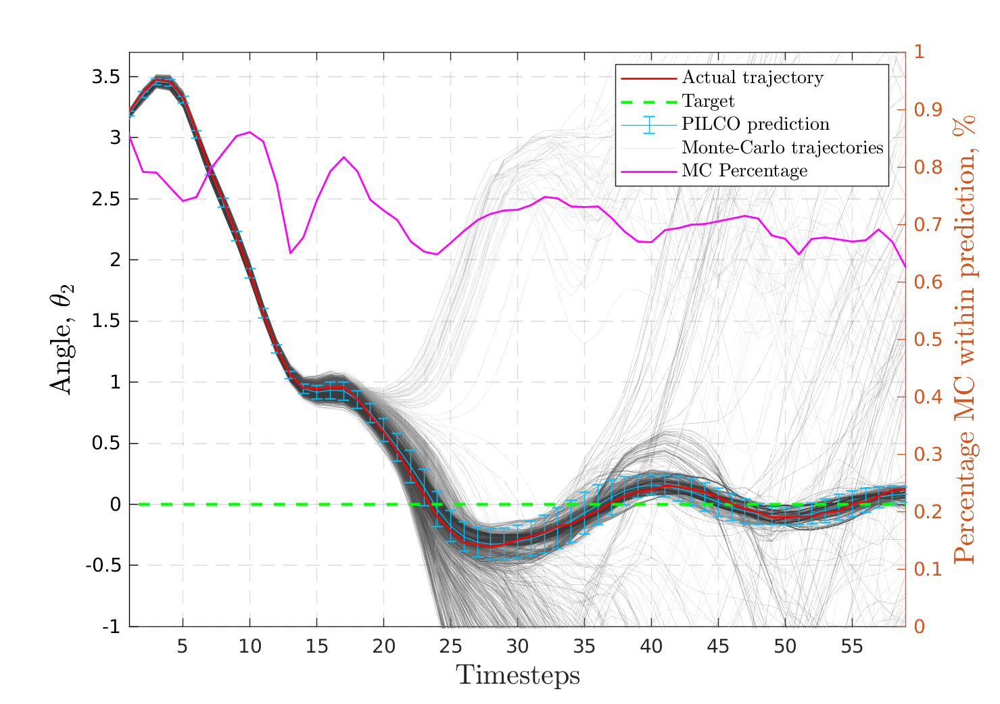
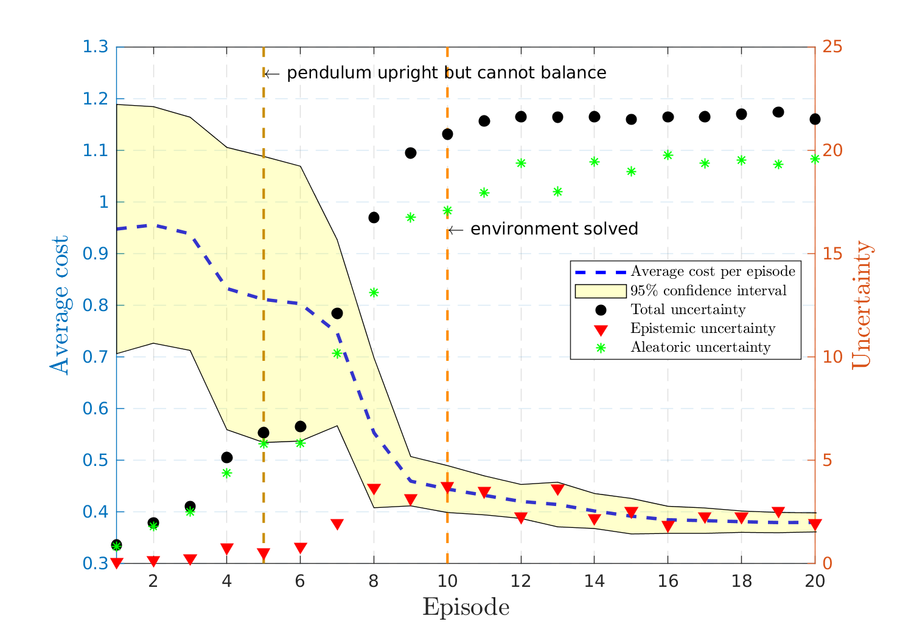
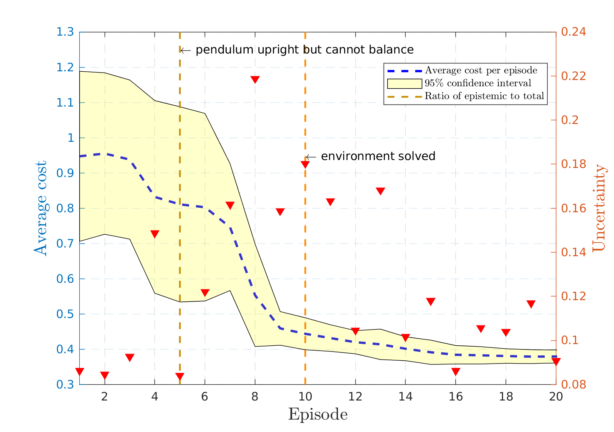
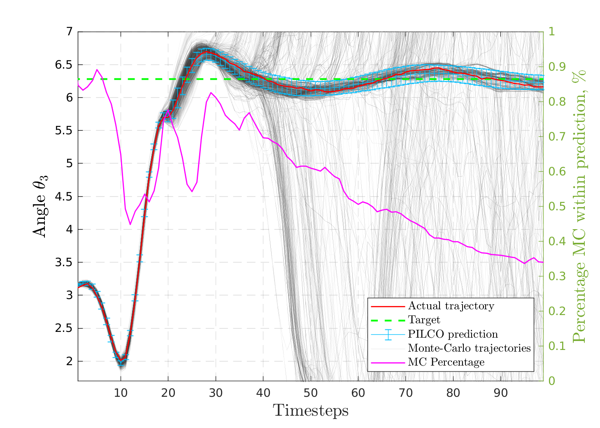
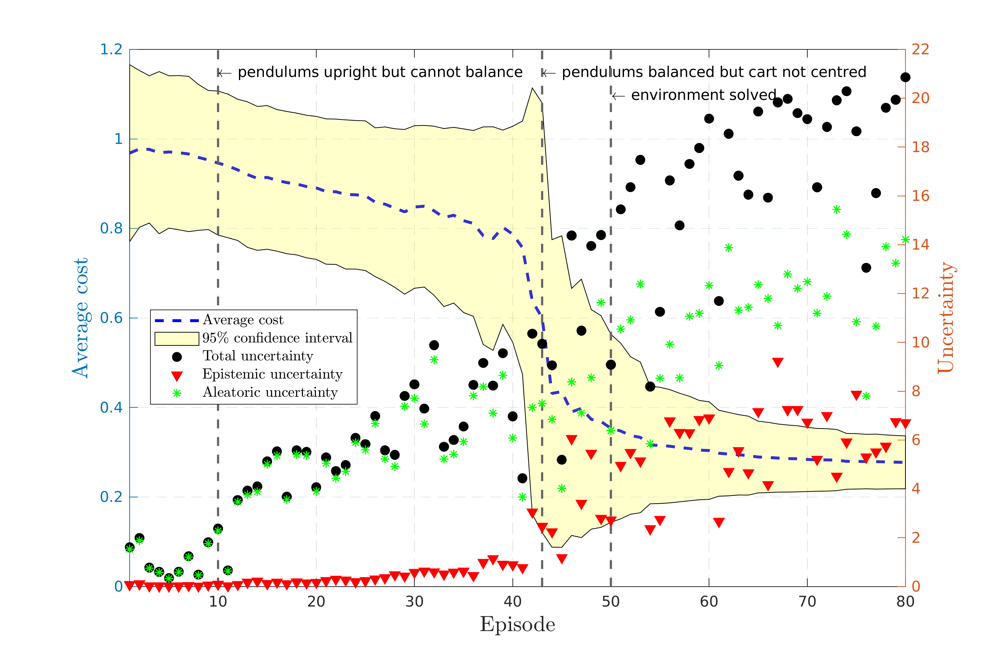
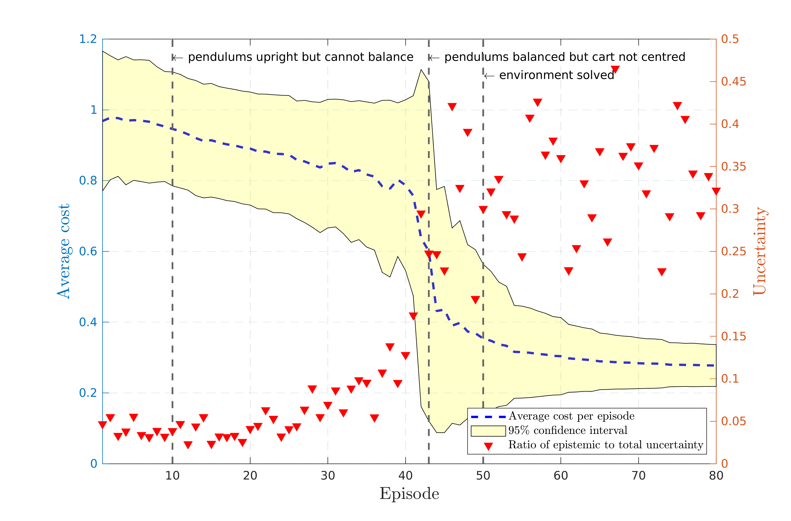

# PILCO - disentangling sources of uncertainty

This repository contains the orgininal PILCO MATLAB code (see pilco_readme.txt and license) with added functionality that disentangles the sources of uncertainty in the cost function for a given policy by Monte Carlo sampling.

Uncertainty analysis implemented for the following scenarios:

* Pendulum
* Cart-Pole
* Pendubot
* Cart-Double-Pendulum

## Run 

Scenarios can be run from from the scenarios folder:

* pendulum_learn.m
* cartPole_learn.m
* pendubot_learn.m
* cartDouble_learn.m

Set the number of Monte Carlo samples in the scenario settings files.

## Plot

Plots of the Monte Carlo samples and uncertainty decomposition can be made for each environment from the scripts in the uncertainty_plots folder.

## Output

example plots for the **pendubot scenario**:

example plots for the **cartDoublePendulum scenario**:

